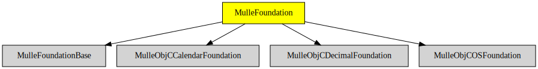

# MulleFoundation

#### 💍 Umbrella library for the MulleFoundation

MulleFoundation combines various Objective-C class libraries into one unifying
Foundation that you `#import` and link against. It also adds the following
class:

Class             | Description
------------------|-----------
`NSConditionLock` |


You will often link against the [Foundation](//github.com/MulleFoundation)
instead of the MulleFoundation though - for increased compatibility
with other platforms' ObjC code.


## What's so different ?

* It is based on the **mulle-objc-runtime**
* The MulleFoundation can be linked statically
* It runs on OS X and Linux (Ubuntu) and FreeBSD, portable Objective-C
* "Everything Faster than Everything Else"


## Constituent Libraries


  Name         | Build Status | Release Version
---------------|--------------|---------------------------------
[MulleObjCArchiverFoundation](//github.com/MulleFoundation/MulleObjCArchiverFoundation)  | [](https://travis-ci.org/MulleFoundation/MulleObjCArchiverFoundation) | 
[MulleObjCCalendarFoundation](//github.com/MulleFoundation/MulleObjCCalendarFoundation)  | [](https://travis-ci.org/MulleFoundation/MulleObjCCalendarFoundation) | 
[MulleObjCDecimalFoundation](//github.com/MulleFoundation/MulleObjCDecimalFoundation)  | [](https://travis-ci.org/MulleFoundation/MulleObjCDecimalFoundation) | 
[MulleObjCKVCFoundation](//github.com/MulleFoundation/MulleObjCKVCFoundation) | [](https://travis-ci.org/MulleFoundation/MulleObjCKVCFoundation) | 
[MulleObjCMathFoundation](//github.com/MulleFoundation/MulleObjCMathFoundation) | [](https://travis-ci.org/MulleFoundation/MulleObjCMathFoundation) | 
[MulleObjCOSFoundation](//github.com/MulleFoundation/MulleObjCOSFoundation) | [](https://travis-ci.org/MulleFoundation/MulleObjCOSFoundation) | 
[MulleObjCUnicodeFoundation](//github.com/MulleFoundation/MulleObjCUnicodeFoundation)  | [](https://travis-ci.org/MulleFoundation/MulleObjCUnicodeFoundation) | 

> MulleObjCOSFoundation one test failure is known and left
> as an exercise for the reader.


### You are here




## Install

See [foundation-developer](//github.com/mulle-objc/foundation-developer)
for installation instructions. In general you don't need to download the
**MulleFoundation** manually. **mulle-sde**, which is part of
*foundation-developer* will do this for you.


## Acknowledgements

Parts of this library:

```
Copyright (c) 2006-2007 Christopher J. W. Lloyd
Permission is hereby granted, free of charge, to any person obtaining a copy of this software and associated documentation files (the "Software"), to deal in the Software without restriction, including without limitation the rights to use, copy, modify, merge, publish, distribute, sublicense, and/or sell copies of the Software, and to permit persons to whom the Software is furnished to do so, subject to the following conditions:
The above copyright notice and this permission notice shall be included in all copies or substantial portions of the Software.
THE SOFTWARE IS PROVIDED "AS IS", WITHOUT WARRANTY OF ANY KIND, EXPRESS OR IMPLIED, INCLUDING BUT NOT LIMITED TO THE WARRANTIES OF MERCHANTABILITY, FITNESS FOR A PARTICULAR PURPOSE AND NONINFRINGEMENT. IN NO EVENT SHALL THE AUTHORS OR COPYRIGHT HOLDERS BE LIABLE FOR ANY CLAIM, DAMAGES OR OTHER LIABILITY, WHETHER IN AN ACTION OF CONTRACT, TORT OR OTHERWISE, ARISING FROM, OUT OF OR IN CONNECTION WITH THE SOFTWARE OR THE USE OR OTHER DEALINGS IN THE SOFTWARE.
```


## Author

[Nat!](//www.mulle-kybernetik.com/weblog) for
[Mulle kybernetiK](//www.mulle-kybernetik.com) and
[Codeon GmbH](//www.codeon.de)
